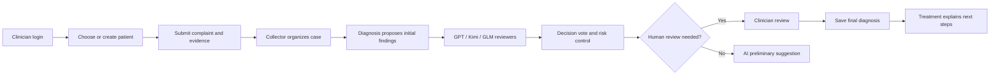

# MedConsensus

MedConsensus is a clinician-facing medical multi-agent consensus workspace. It collects a patient’s chief complaint and supporting evidence, coordinates Collector, Diagnosis, Reviewer, and Decision stages, streams progress in real time, and stores a final diagnosis and treatment note after clinician review.

> ⚕️ **Clinical safety**: MedConsensus is a decision-support tool. It must not be used for self-diagnosis or automatic prescribing. A qualified clinician must confirm every diagnosis and medication recommendation.

[中文](README.md) · [Project guide](docs/project-guide.md) · [Deployment guide](docs/deployment.md) · [MIT License](LICENSE)

## 🧭 Choose a path

| If you want to… | Start here | You will get |
| --- | --- | --- |
| Try the complete workspace locally (recommended) | [Local development](#-local-development) | A React UI at `http://localhost:5173` |
| Run the supporting services in containers | [Docker dependencies](#1-start-the-supporting-services) | PostgreSQL, Redis, and Neo4j |
| Prepare a server deployment | [Deployment guide](docs/deployment.md) | Compose setup, environment variables, health checks, and upgrade notes |

## 🔎 Core workflow



The patient portal supports clinician binding, follow-up consultation, and evidence upload. The clinician workspace handles collaboration, evidence confirmation, and report publishing. Progress is delivered over STOMP WebSocket `/ws/diagnosis` to `/user/queue/pipeline`.

## ✨ Capabilities

- **Multi-agent consensus**: Collector, Diagnosis, Reviewer, Decision, and Treatment agents run through a LangGraph4j workflow.
- **Evidence enrichment**: Parse PDF, DOCX, JPG, JPEG, and PNG files, with pgvector embedding storage/import and Neo4j medical knowledge-graph evidence.
- **Human-in-the-loop**: High-risk or confirmation-required results go to clinician review before a final record is created.
- **Live workspace**: React + Vite pages for authentication, patients, sessions, diagnosis, evidence review, and history.
- **Observability**: Optional LangSmith / OpenTelemetry tracing; content capture is disabled by default.

## 🧱 Technology stack

| Layer | Components |
| --- | --- |
| Backend | Java 17, Spring Boot 3.3.0, Spring AI OpenAI Starter 1.0.0-M6, LangGraph4j 1.5.14 |
| Frontend | React 18.3, Vite 5, STOMP WebSocket |
| Data and infrastructure | PostgreSQL + pgvector, Redis, Neo4j, Docker Compose |
| Observability and documents | OpenTelemetry, LangSmith (optional), PDFBox, Apache POI |

## 🚀 Local development

### Prerequisites

- Java 17 and Maven
- Node.js 20 (used by the frontend build)
- Docker Compose v2 (to run PostgreSQL, Redis, and Neo4j)
- `API_KEY` and `OPENAI_API_KEY` for the complete diagnosis workflow; add `MIMO_API_KEY` when using the Treatment Agent.

### 1. Start the supporting services

From the repository root:

```bash
docker compose -f docker/deploy/docker-compose.yml up -d postgres redis neo4j
```

On an empty PostgreSQL volume, the initialization script creates the business tables, the `vector_db` database, and its pgvector table. Existing volumes are not reinitialized automatically.

### 2. Start the backend

Set model keys in the backend shell (never commit real keys), then run:

```bash
export API_KEY=your_dashscope_api_key
export OPENAI_API_KEY=your_openai_api_key
export MIMO_API_KEY=your_mimo_api_key       # optional
mvn spring-boot:run
```

The backend listens on port `8086`. Check its health endpoint:

```bash
curl http://127.0.0.1:8086/actuator/health
```

### 3. Start the frontend

In a second terminal:

```bash
cd frontend
npm ci
npm run dev
```

Open `http://localhost:5173`. Vite proxies `/api` and `/ws` to `http://127.0.0.1:8086`.

Build frontend assets into the Spring Boot static-resource directory:

```bash
npm run build
```

Run the backend test suite from the repository root:

```bash
cd ..
mvn test
```

## ⚙️ Configuration

The main configuration lives in `src/main/resources/application.yml`. Inject these values through the environment in deployed environments:

| Variable | Purpose |
| --- | --- |
| `API_KEY` | DashScope-compatible API for Collector, Reviewers, Decision, Embedding, and related agents |
| `OPENAI_API_KEY` | GPT diagnosis/review and vision models |
| `MIMO_API_KEY` | Treatment Agent |
| `SPRING_DATASOURCE_URL`, `POSTGRES_USER`, `POSTGRES_PASSWORD` | PostgreSQL business database |
| `REDIS_HOST`, `REDIS_PORT` | Redis sessions and diagnosis snapshots |
| `NEO4J_URI`, `NEO4J_USER`, `NEO4J_PASSWORD` | Medical knowledge graph |
| `LANGSMITH_ENABLED`, `LANGSMITH_API_KEY` | Optional LangSmith tracing |

For Docker Compose deployment, create `docker/deploy/.env` with the required values. This file contains secrets and must stay out of version control. Before deployment, verify that `PGVECTOR_DATABASE` matches the `vector_db` database initialized by `docker/postgres/init/01-init.sql`, and adjust the nginx static-directory mount to your server path.

## 🔌 Common endpoints

| Area | Paths |
| --- | --- |
| Authentication | `POST /api/auth/register`, `POST /api/auth/login`, `GET /api/auth/me`, `POST /api/auth/logout` |
| Clinician workspace | `/api/workspace/patients`, `/api/workspace/sessions`, `/api/workspace/consultations`, `/api/workspace/doctor-review` |
| Patient portal | `/api/patient/dashboard`, `/api/patient/consultations`, `/api/patient/reports/{reportId}/explanations` |
| Collaboration | `/api/workspace/collaboration`, `/api/workspace/diagnosis-records/{recordId}/publish` |
| Live progress | STOMP `/ws/diagnosis`, subscribe to `/user/queue/pipeline` |

See the [project guide](docs/project-guide.md) for the full route and data-model reference.

## 🗂️ Repository layout

```text
frontend/                         React + Vite frontend
src/main/java/com/zyt/medconsensus
  agent/ graph/ graphkg/ rag/     Agents, workflow, graph, and vector storage/import
  controller/ service/            REST controllers and orchestration
  llm/ observability/             Model gateway and tracing
src/main/resources/               Spring configuration, migrations, and static assets
docker/                           Dockerfile, Compose, and PostgreSQL init
docs/                             Project and deployment guides
```

## 📚 Documentation and contribution

- [Project guide](docs/project-guide.md): modules, workflow, endpoints, storage, and development conventions.
- [Deployment guide](docs/deployment.md): Compose deployment, environment variables, health checks, backups, and troubleshooting.
- Issues and pull requests are welcome. Preserve clinician-review language when changing medical recommendation flows.

## 📄 License

Released under the [MIT License](LICENSE).
