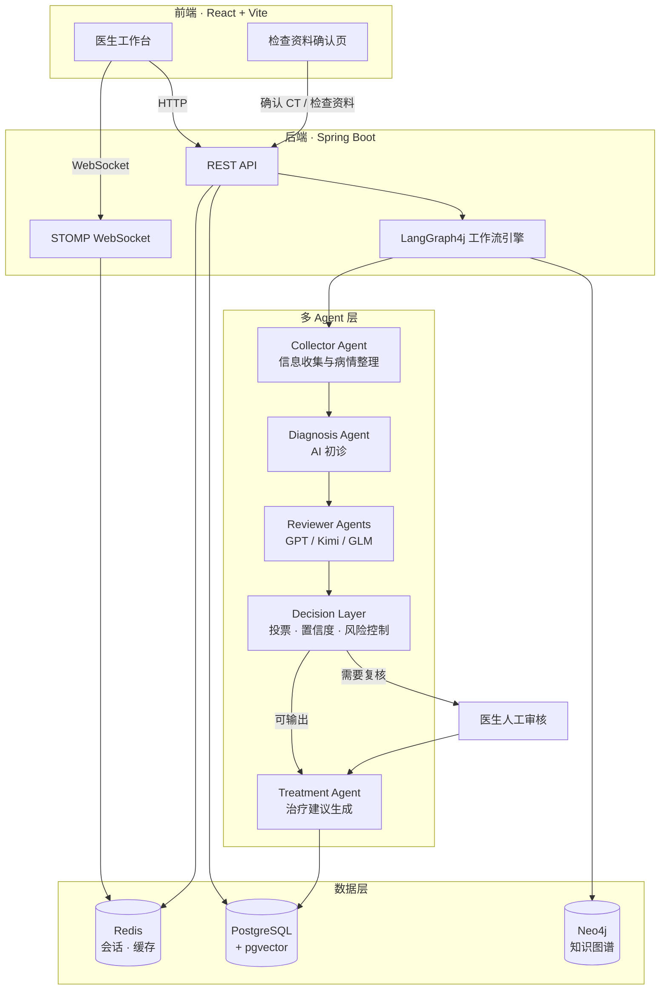

<h1 align="center">MedConsensus</h1>

<p align="center">
  <strong>基于多 Agent 共识机制的医疗辅助诊断系统</strong>
</p>

<p align="center">
  
  
  
  
  
  
</p>

---

> 面向医生工作台的医疗多 Agent 辅助诊断系统，支持患者资料管理、问诊信息整理、CT/检查资料确认后进入诊断、Neo4j 图谱增强、多模型评审、医生复核和治疗建议生成。

MedConsensus 是一个 Spring Boot + React 全栈项目。后端负责编排 LangGraph4j 多 Agent 工作流、会话存储、患者资料、医生账号、知识图谱查询和最终诊断记录；前端提供医生工作台、患者列表、诊断进度、检查资料确认、医生复核和报告生成界面。

> 免责声明：本项目是医疗辅助决策系统示例，不替代执业医生诊断、临床判断、影像报告或处方审核。AI 输出必须由具备资质的医生结合真实病历和检查资料复核。

## 当前核心流程

1. 医生登录或注册后进入工作台。
2. 在患者列表中新增或选择患者，填写患者本次诉求。
3. 如果没有上传 CT/检查报告，医生可直接提交诉求进入诊断 Agent。
4. 如果上传了 CT、影像截图、PDF、DOCX 或检查报告图片，系统先调用视觉/文档解析模型做结构化识别。
5. 只要本轮上传过检查资料，文字提交按钮不会直接进入诊断；医生必须在“检查资料识别确认”页确认或清除资料。
6. 医生点击“确认并用于诊断 Agent”后，系统把患者文字诉求、结构化检查资料和医生确认备注合并后进入诊断工作流。
7. “患者诊断依据补充”区域的内容可点击“填入患者诉求”，追加到左侧患者诉求输入框，由医生确认后再提交。
8. 工作流完成 Collector、Diagnosis、Reviewer、Decision 等节点后展示 AI 初步诊断、依据、建议和流程动态。
9. 医生提交人工复核意见后，系统保存最终诊断记录，并可生成 Treatment Agent 治疗/开药说明。

## 功能概览

- 医生账号：注册、登录、会话保持和退出登录。
- 患者管理：新增、编辑、删除患者基本信息，并写入患者个人 skill 记忆。
- 会话管理：Redis 保存问诊会话、消息历史、诊断快照和会话列表。
- 多 Agent 诊断：Collector 信息整理、Diagnosis 初诊、Reviewer 并行复核、Decision 决策、Human Review 和 Finalize。
- CT/检查资料流程：上传 PDF、DOCX、JPG、PNG 后先识别，再由医生确认或清除，确认后才进入诊断 Agent。
- 诊断依据补充：补充内容可回填到患者诉求，避免只停留在页面备注。
- 知识图谱增强：Neo4j 执行“症状 -> 疾病 -> 治疗/检查”路径推理，并把命中结果并入诊断依据。
- 最终记录与治疗建议：医生复核后保存最终诊断，Treatment Agent 结合数据库或模型生成治疗建议。

## 技术栈

| 层 | 技术 |
|----|------|
| 后端 | Java 17, Spring Boot 3.3.0, Spring Web, WebSocket, Validation, Actuator |
| Agent 编排 | LangGraph4j 1.5.14 |
| LLM 接入 | Spring AI OpenAI starter, 自定义 MultiModelGateway |
| 数据库 | PostgreSQL, Spring Data JPA |
| 会话缓存 | Redis, Redisson |
| 知识图谱 | Neo4j Java Driver |
| 文档解析 | Apache PDFBox, Apache POI |
| 前端 | React 18, Vite 5, lucide-react, STOMP WebSocket |
| 部署 | Dockerfile, Docker Compose, Nginx 配置 |
| 可观测性 | OpenTelemetry, LangSmith REST/OTLP 配置开关 |

## 系统架构



核心诊断工作流位于 `CollectorAgentServiceImpl`：

```text
collect -> assess -> ask_more_info
                 \-> diagnose -> review -> decide -> retry_collect / human_review / finalize
```

## 项目结构

```text
.
├── docker/
│   ├── deploy/                  # Dockerfile、Compose、Nginx 部署配置
│   └── postgres/init/           # PostgreSQL / pgvector 初始化脚本
├── docs/                        # 部署说明与项目说明文档
├── frontend/                    # React + Vite 前端源码
│   ├── src/api/                 # auth、workspace、websocket API 封装
│   ├── src/components/          # 工作台、诊断、复核、检查资料确认等组件
│   └── vite.config.js           # 构建输出到 Spring Boot static
├── partiality/                  # 患者个人 skill 记忆目录
├── src/main/java/com/zyt/medconsensus/
│   ├── agent/                   # Collector、Diagnosis、Reviewer、Treatment Agent
│   ├── controller/              # Auth 与 Workspace REST API
│   ├── graphkg/                 # Neo4j 知识图谱导入与推理
│   ├── importer/                # 医疗 JSON 向量导入入口
│   ├── llm/                     # 多模型网关与模型配置
│   ├── rag/                     # pgvector 与 embedding 支持
│   ├── service/                 # 业务服务与诊断流程编排
│   └── tool/                    # 信息充足度、风险、投票等工作流工具
├── src/main/resources/
│   ├── application.yml          # 默认配置与环境变量绑定
│   └── static/                  # 前端生产构建产物
└── pom.xml
```

## 本地开发

### 前置条件

- JDK 17+
- Maven 3.9+
- Node.js 20+
- PostgreSQL
- Redis
- Neo4j
- 可用的模型 API Key 和对应服务地址

### 后端启动

```bash
mvn spring-boot:run
```

默认服务端口为 `8086`。配置项来自 `src/main/resources/application.yml`，真实凭据请通过环境变量或本机私有配置注入。

常用环境变量：

| 变量 | 用途 |
|------|------|
| `SPRING_DATASOURCE_URL` | PostgreSQL 业务库连接 |
| `POSTGRES_USER` / `POSTGRES_PASSWORD` | PostgreSQL 账号 |
| `REDIS_HOST` / `REDIS_PORT` | Redis 地址 |
| `NEO4J_URI` / `NEO4J_USER` / `NEO4J_PASSWORD` | Neo4j 连接 |
| `API_KEY` | DashScope 兼容接口模型、embedding、图谱抽取等 |
| `OPENAI_API_KEY` | 主诊断或视觉模型配置 |
| `MIMO_API_KEY` | Treatment Agent 配置 |
| `LANGSMITH_ENABLED` | 是否启用 LangSmith 追踪 |

### 前端启动

```bash
cd frontend
npm install
npm run dev
```

Vite 开发服务器默认监听 `127.0.0.1:5173`，并把 `/api` 与 `/ws` 代理到后端 `8086`。

### 构建前端并打包到后端

```bash
cd frontend
npm run build
```

前端生产产物会输出到 `src/main/resources/static`，随后可由 Spring Boot 直接提供单页应用。

### 测试

```bash
mvn test
```

## Docker 部署

仓库包含多阶段 Dockerfile：

1. Node 20 构建前端。
2. Maven + Temurin 17 构建 Spring Boot JAR。
3. Temurin 17 JRE 运行最终应用。

Compose 配置包含应用、Nginx、PostgreSQL/pgvector、Redis 和 Neo4j。部署前请在运行环境中提供必要环境变量，尤其是模型 API Key、数据库连接和图数据库连接信息。

```bash
docker compose -f docker/deploy/docker-compose.yml up -d
```

## API 概览

| Method | Path | Source | 说明 |
|--------|------|--------|------|
| POST | `/api/auth/register` | `AuthController` | 医生注册并建立会话 |
| POST | `/api/auth/login` | `AuthController` | 医生登录 |
| GET | `/api/auth/me` | `AuthController` | 获取当前登录医生 |
| POST | `/api/auth/logout` | `AuthController` | 退出登录 |
| GET | `/api/workspace/patients` | `MedicalWorkspaceController` | 当前医生患者列表 |
| POST | `/api/workspace/patients` | `MedicalWorkspaceController` | 新增患者 |
| PUT | `/api/workspace/patients/{patientId}` | `MedicalWorkspaceController` | 更新患者 |
| DELETE | `/api/workspace/patients/{patientId}` | `MedicalWorkspaceController` | 删除患者 |
| GET | `/api/workspace/sessions` | `MedicalWorkspaceController` | 问诊会话列表 |
| GET | `/api/workspace/sessions/{sessionId}` | `MedicalWorkspaceController` | 会话详情 |
| DELETE | `/api/workspace/sessions/{sessionId}` | `MedicalWorkspaceController` | 删除会话 |
| GET | `/api/workspace/diagnosis` | `MedicalWorkspaceController` | 最近诊断快照 |
| POST | `/api/workspace/consultations` | `MedicalWorkspaceController` | 提交问诊并触发诊断工作流 |
| POST | `/api/workspace/medical-evidence/analyze` | `MedicalWorkspaceController` | 上传并识别 CT/检查资料 |
| POST | `/api/workspace/doctor-review` | `MedicalWorkspaceController` | 医生复核并保存最终记录 |
| GET | `/api/workspace/diagnosis-records` | `MedicalWorkspaceController` | 最终诊断记录列表 |
| DELETE | `/api/workspace/diagnosis-records/{recordId}` | `MedicalWorkspaceController` | 删除诊断记录 |
| GET | `/api/workspace/doctor-stats` | `MedicalWorkspaceController` | 医生工作台统计 |
| POST | `/api/workspace/graph-explore` | `MedicalWorkspaceController` | 查询 Neo4j 图谱路径 |
| POST | `/api/workspace/import-case` | `MedicalWorkspaceController` | 导入病例文件并生成患者/记录 |

WebSocket/STOMP 用于推送诊断流程动态，前端订阅 `/topic/pipeline`。

## 检查资料与病例文件

当前允许上传：

- PDF
- DOCX
- JPG / JPEG
- PNG

后端限制单文件与请求大小为 50MB。检查资料识别成功后状态为待医生确认；未确认的结构化检查资料不会进入诊断 Agent。

## 知识图谱与向量导入

- Neo4j 图谱推理入口位于 `graphkg` 包，查询“症状 -> 疾病 -> 治疗/检查”路径。
- 图谱导入入口为 `MedicalKnowledgeGraphImportApplication`。
- pgvector / embedding 支持位于 `rag` 与 `importer` 包，向量导入入口为 `MedicalJsonVectorImportApplication`。
- 图谱是否命中取决于 Neo4j 中是否已有对应节点和关系；代码中只负责抽取查询词并执行路径查询。

## 安全与隐私

项目默认配置只保留运行所需的配置结构。生产环境中的模型 Key、数据库密码、图数据库密码和追踪服务凭据应通过环境变量或私有配置注入，不建议写入仓库。

系统会处理患者主诉、检查资料、诊断结论和医生复核意见。演示、测试和截图时请优先使用脱敏数据；如启用 LangSmith、OpenTelemetry 或第三方模型服务，需要先确认医疗数据出境、留存和审计要求。

## License

本项目基于 MIT License 开源，允许自由使用、复制、修改、合并、发布、分发、再授权和销售本软件副本。使用时请保留原始版权声明和许可证声明。

完整许可证文本见 [LICENSE](LICENSE)。
