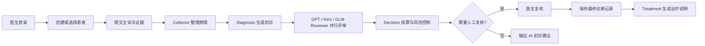

# MedConsensus

面向医生的医疗多 Agent 共识诊断工作台：收集患者主诉与检查证据，编排 Collector、Diagnosis、Reviewer 和决策层，实时推送流程进度，并在医生复核后保存最终诊断与治疗建议。

> ⚕️ **医疗安全提示**：MedConsensus 是医生辅助工具，不用于患者自诊或自动处方。所有诊断和用药建议都必须由具备资质的医生确认。

[English](README.en.md) · [项目说明](docs/project-guide.md) · [部署指南](docs/deployment.md) · [MIT License](LICENSE)

## 🧭 选择入口

| 目标 | 入口 | 结果 |
| --- | --- | --- |
| 本地体验完整工作台（推荐） | [本地开发](#-本地开发) | 在 `http://localhost:5173` 打开 React 界面 |
| 使用容器运行依赖服务 | [Docker 依赖服务](#1-启动依赖服务) | 启动 PostgreSQL、Redis、Neo4j |
| 了解生产部署 | [部署指南](docs/deployment.md) | Docker Compose、环境变量、健康检查与升级说明 |

## 🔎 核心流程



系统还提供患者端绑定医生、补充咨询与证据上传，以及医生端协作确认和报告发布。诊断过程通过 STOMP WebSocket `/ws/diagnosis` 推送到用户队列 `/user/queue/pipeline`。

## ✨ 能力范围

- **多 Agent 共识**：Collector、Diagnosis、Reviewer、Decision、Treatment 按 LangGraph4j 工作流协作。
- **证据增强**：从 PDF、DOCX、JPG、JPEG、PNG 中解析资料，并支持 pgvector 向量存储/导入与 Neo4j 医学知识图谱证据。
- **Human-in-the-loop**：高风险或需要确认的结果进入医生复核，复核后才生成最终记录。
- **实时工作台**：React + Vite 单页界面，包含认证、患者、会话、诊断、证据审阅和历史记录页面。
- **可观测性**：可选 LangSmith / OpenTelemetry 追踪；默认不采集患者文本内容。

## 🧱 技术栈

| 层 | 组件 |
| --- | --- |
| 后端 | Java 17、Spring Boot 3.3.0、Spring AI OpenAI Starter 1.0.0-M6、LangGraph4j 1.5.14 |
| 前端 | React 18.3、Vite 5、STOMP WebSocket |
| 数据与基础设施 | PostgreSQL + pgvector、Redis、Neo4j、Docker Compose |
| 观测与文档 | OpenTelemetry、LangSmith（可选）、PDFBox、Apache POI |

## 🚀 本地开发

### 前置条件

- Java 17、Maven
- Node.js 20（前端构建使用）
- Docker Compose v2（用于启动 PostgreSQL、Redis、Neo4j）
- 完整诊断流程需要 `API_KEY` 和 `OPENAI_API_KEY`；如启用 Treatment Agent，再配置 `MIMO_API_KEY`。

### 1. 启动依赖服务

在仓库根目录执行：

```bash
docker compose -f docker/deploy/docker-compose.yml up -d postgres redis neo4j
```

初始化脚本会在 PostgreSQL 数据卷首次创建时建立业务表、`vector_db` 和 pgvector 表。已有数据卷不会重复执行初始化脚本。

### 2. 启动后端

在运行后端的终端设置模型密钥（不要把真实密钥提交到仓库），然后执行：

```bash
export API_KEY=your_dashscope_api_key
export OPENAI_API_KEY=your_openai_api_key
export MIMO_API_KEY=your_mimo_api_key       # 可选
mvn spring-boot:run
```

后端监听 `8086`。健康检查：

```bash
curl http://127.0.0.1:8086/actuator/health
```

### 3. 启动前端

另开终端：

```bash
cd frontend
npm ci
npm run dev
```

访问 `http://localhost:5173`。Vite 已将 `/api` 和 `/ws` 代理到 `http://127.0.0.1:8086`。

构建前端静态资源（输出到 Spring Boot 的静态目录）：

```bash
npm run build
```

运行测试：

```bash
cd ..
mvn test
```

## ⚙️ 配置

主要配置位于 `src/main/resources/application.yml`，生产环境建议通过环境变量注入：

| 变量 | 用途 |
| --- | --- |
| `API_KEY` | DashScope 兼容接口，Collector、Reviewer、Decision、Embedding 等使用 |
| `OPENAI_API_KEY` | GPT 诊断/评审与视觉模型 |
| `MIMO_API_KEY` | Treatment Agent |
| `SPRING_DATASOURCE_URL`、`POSTGRES_USER`、`POSTGRES_PASSWORD` | PostgreSQL 业务库 |
| `REDIS_HOST`、`REDIS_PORT` | Redis 会话与诊断快照 |
| `NEO4J_URI`、`NEO4J_USER`、`NEO4J_PASSWORD` | 医学知识图谱 |
| `LANGSMITH_ENABLED`、`LANGSMITH_API_KEY` | 可选 LangSmith 追踪 |

使用 Docker Compose 部署时，请在 `docker/deploy/.env` 中填写变量；该文件包含敏感信息，不应提交。部署前请核对 `PGVECTOR_DATABASE` 与 `docker/postgres/init/01-init.sql` 中的 `vector_db` 初始化设置，并按服务器实际路径调整 nginx 的静态目录挂载。

## 🔌 常用接口

| 领域 | 路径 |
| --- | --- |
| 认证 | `POST /api/auth/register`、`POST /api/auth/login`、`GET /api/auth/me`、`POST /api/auth/logout` |
| 医生工作台 | `/api/workspace/patients`、`/api/workspace/sessions`、`/api/workspace/consultations`、`/api/workspace/doctor-review` |
| 患者端 | `/api/patient/dashboard`、`/api/patient/consultations`、`/api/patient/reports/{reportId}/explanations` |
| 医患协作 | `/api/workspace/collaboration`、`/api/workspace/diagnosis-records/{recordId}/publish` |
| 实时进度 | STOMP `/ws/diagnosis`，订阅 `/user/queue/pipeline` |

完整接口与数据模型见 [项目说明](docs/project-guide.md)。

## 🗂️ 项目结构

```text
frontend/                         React + Vite 前端
src/main/java/com/zyt/medconsensus
  agent/ graph/ graphkg/ rag/     Agent、工作流、知识图谱、向量存储与导入
  controller/ service/            REST API 与业务编排
  llm/ observability/             多模型网关与追踪
src/main/resources/               Spring Boot 配置、迁移与静态资源
docker/                           Dockerfile、Compose、PostgreSQL 初始化
 docs/                            项目说明与部署文档
```

## 📚 文档与贡献

- [项目说明](docs/project-guide.md)：模块、流程、接口、数据存储和开发约定。
- [部署指南](docs/deployment.md)：Compose 部署、环境变量、健康检查、备份与排障。
- 欢迎提交 Issue 或 Pull Request；涉及医疗建议的改动请保留医生复核语义。

## 📄 许可证

本项目采用 [MIT License](LICENSE)。
