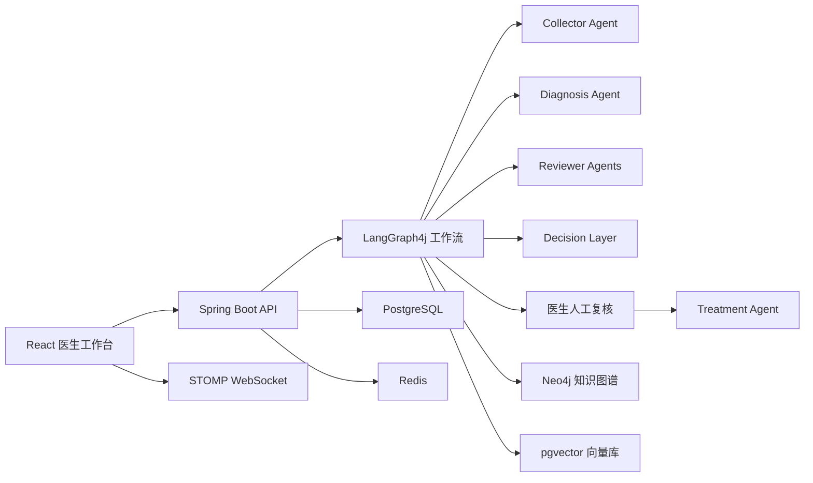

# MedConsensus

MedConsensus 是一个面向医疗问诊辅助场景的多 Agent 共识诊断系统。系统通过信息收集 Agent、诊断 Agent、多模型 Reviewer、决策层和医生人工复核流程，将患者主诉整理、AI 初诊、模型交叉评审、风险控制和最终诊断记录串联成一个完整的医生工作台。

> 项目定位是医生辅助决策系统，不替代执业医生诊断、临床判断或处方审核。

## 核心能力

- 基于 LangGraph4j 的多 Agent 工作流编排。
- Collector、Diagnosis、Reviewer、Decision、Treatment 多角色模型配置。
- Qwen、Kimi、GLM 等 Reviewer 角色并行评审，辅助形成共识结果。
- Human-in-the-loop 医生复核，最终结论以医生确认结果为准。
- PostgreSQL 保存医生、患者、药品参考和最终诊断记录。
- Redis 保存会话列表、对话历史和诊断快照。
- Neo4j 支持医学知识图谱证据补充。
- pgvector 支持医疗语料向量化检索与导入。
- React + Vite 医生工作台，支持 REST API 与 WebSocket 实时流程推送。
- Docker Compose 一键部署应用、PostgreSQL、Redis、Neo4j 和可选 nginx。

## 系统架构



## 快速部署

推荐使用 Docker Compose 部署。项目镜像已发布到阿里云容器镜像服务：

```text
crpi-4wwu4n7c8aebuv9g.cn-hangzhou.personal.cr.aliyuncs.com/lofty/medconsensus:dev
```

如果镜像仓库是私有仓库，需要先使用已授权的只读拉取账号登录：

```bash
docker login --username=<authorized_username> crpi-4wwu4n7c8aebuv9g.cn-hangzhou.personal.cr.aliyuncs.com
```

拉取项目并准备环境变量：

```bash
git clone <your-repository-url> MedConsensus
cd MedConsensus
cp docker/deploy/.env.example docker/deploy/.env
```

编辑 `docker/deploy/.env`，至少设置：

```env
APP_IMAGE=crpi-4wwu4n7c8aebuv9g.cn-hangzhou.personal.cr.aliyuncs.com/lofty/medconsensus:dev
POSTGRES_PASSWORD=change_me
NEO4J_PASSWORD=change_me
API_KEY=your_dashscope_api_key
MIMO_API_KEY=your_mimo_api_key
```

启动服务：

```bash
cd docker/deploy
docker compose pull
docker compose up -d
```

访问应用：

```text
http://localhost:8086
```

如需通过 nginx 反向代理访问：

```bash
docker compose --profile proxy up -d
```

访问：

```text
http://localhost
```

完整部署步骤见 [部署文档](docs/deployment.md)。

## 本地开发

环境要求：

- JDK 17
- Maven 3.9+
- Node.js 20+
- PostgreSQL 16，建议安装 pgvector 扩展
- Redis 7+
- Neo4j 5+

启动后端：

```bash
mvn spring-boot:run
```

启动前端开发服务：

```bash
cd frontend
npm ci
npm run dev
```

默认访问地址：

- 后端和打包后的前端页面：`http://127.0.0.1:8086`
- Vite 前端开发服务：`http://127.0.0.1:5173`

前端开发代理：

- `/api` -> `http://127.0.0.1:8086`
- `/ws` -> `ws://127.0.0.1:8086`

## 文档

- [部署文档](docs/deployment.md)
- [项目说明文档](docs/project-guide.md)

## 目录结构

```text
.
├── docker/                 # Dockerfile、Compose、nginx、数据库初始化脚本
├── docs/                   # 部署文档与项目说明
├── frontend/               # React + Vite 前端
├── src/main/java/          # Spring Boot 后端
├── src/main/resources/     # application.yml 与打包后的静态资源
└── pom.xml                 # Maven 项目配置
```

## 安全说明

- 不要提交 `docker/deploy/.env`。
- 对外分享镜像时，建议使用只读拉取账号，不要共享个人主账号密码。
- 模型 API Key、数据库密码等敏感配置应通过环境变量注入。
- 医疗场景下建议保持 `LANGSMITH_CAPTURE_CONTENT=false`，避免将患者文本内容发送到外部追踪平台。

## License

当前仓库尚未声明开源许可证。如需公开分发或允许他人复用代码，请补充 `LICENSE` 文件。
