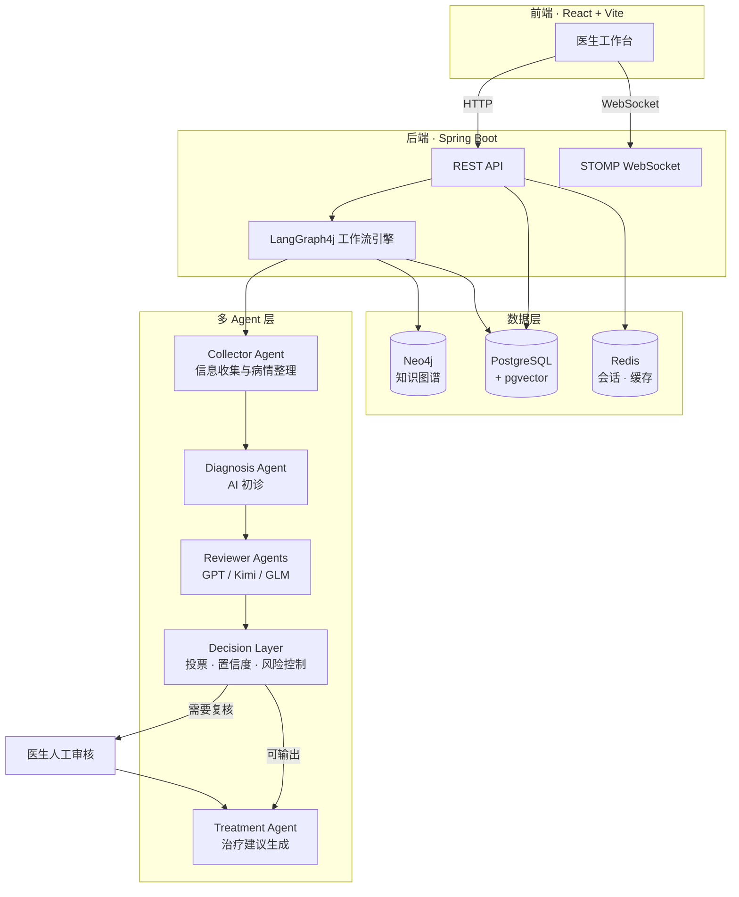
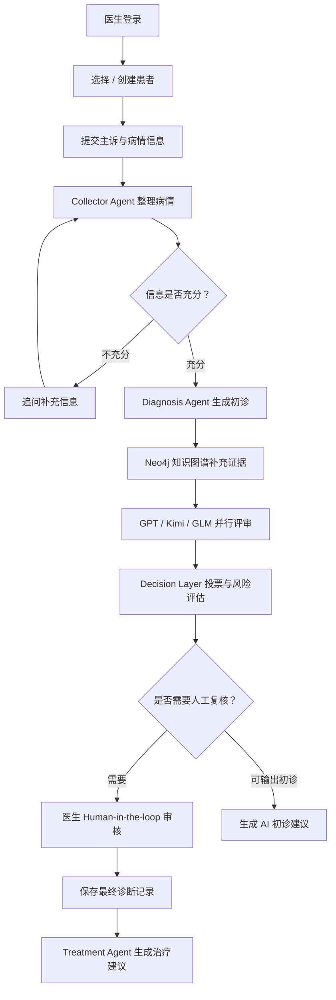

<h1 align="center">MedConsensus</h1>

<p align="center">
  <strong>基于多 Agent 共识机制的医疗辅助诊断系统</strong>
</p>

<p align="center">
  
  
  
  
  
  
</p>

---

## 项目简介

MedConsensus 是一个面向医疗问诊辅助场景的**多 Agent 共识诊断系统**。系统通过信息收集 Agent、诊断 Agent、多模型 Reviewer、决策层和医生人工复核流程，将患者主诉整理、AI 初诊、模型交叉评审、风险控制和最终诊断记录串联成一个完整的医生工作台。

> **免责声明**：本系统定位为医生辅助决策工具，不替代执业医生诊断、临床判断或处方审核。最终诊断和用药建议必须由具备资质的医生确认。

---

## 核心特性

- **多 Agent 协作** — Collector、Diagnosis、Reviewer、Decision、Treatment 五大角色协同工作
- **多模型交叉评审** — GPT、Kimi、GLM 等多模型并行评审，加权投票形成共识
- **Human-in-the-loop** — 医生复核机制，最终结论以医生确认结果为准
- **知识图谱增强** — Neo4j 医学知识图谱补充诊断证据
- **向量检索** — pgvector 支持医疗语料语义检索与 RAG 增强
- **实时流程推送** — WebSocket STOMP 协议，诊断进度实时可视化
- **一键部署** — Docker Compose 编排全部依赖服务

---

## 系统架构



---

## 业务流程



---

## 项目结构

```
MedConsensus/
├── docker/                          # 部署配置
│   ├── deploy/
│   │   ├── Dockerfile               # 多阶段构建（Node → Maven → JRE）
│   │   ├── docker-compose.yml       # 全服务编排
│   │   ├── .env.example             # 环境变量模板
│   │   └── nginx/
│   │       └── medconsensus.conf    # Nginx 反向代理配置
│   └── postgres/
│       └── init/
│           └── 01-init.sql          # 数据库初始化脚本
├── docs/                            # 项目文档
│   ├── deployment.md                # 完整部署指南
│   └── project-guide.md             # 项目说明文档
├── frontend/                        # 前端 · React + Vite
│   ├── src/
│   │   ├── api/                     # API 封装（auth · workspace · websocket）
│   │   ├── components/              # UI 组件
│   │   │   ├── AuthPanel.jsx        # 登录注册面板
│   │   │   ├── Sidebar.jsx          # 患者与会话侧栏
│   │   │   ├── DiagnosticPanel.jsx  # AI 诊断结果展示
│   │   │   ├── DoctorPanel.jsx      # 医生复核输入
│   │   │   ├── SessionDetailPanel.jsx
│   │   │   └── Header.jsx
│   │   ├── App.jsx                  # 应用主入口
│   │   └── styles.css
│   ├── vite.config.js
│   └── package.json
├── src/
│   ├── main/
│   │   ├── java/com/zyt/medconsensus/
│   │   │   ├── agent/               # AI Agent 实现
│   │   │   │   ├── CollectorAgent.java
│   │   │   │   ├── DiagnosisAgent.java
│   │   │   │   ├── ReviewerAgent.java
│   │   │   │   ├── TreatmentAgent.java
│   │   │   │   └── schema/          # Agent 输出结构定义
│   │   │   ├── config/              # 配置（CORS · Redis · Security · WebSocket）
│   │   │   ├── controller/          # REST 接口
│   │   │   ├── dto/                 # 数据传输对象
│   │   │   ├── entity/              # JPA 实体
│   │   │   ├── graph/               # LangGraph 工作流状态
│   │   │   ├── graphkg/             # Neo4j 知识图谱操作
│   │   │   ├── importer/            # 医疗数据向量导入
│   │   │   ├── llm/                 # 多模型调用网关
│   │   │   ├── mapper/              # MyBatis / JPA Mapper
│   │   │   ├── observability/       # LangSmith / OpenTelemetry
│   │   │   ├── rag/                 # RAG 向量检索
│   │   │   ├── service/             # 业务逻辑
│   │   │   └── tool/                # 工具函数（风险评估 · 投票）
│   │   └── resources/
│   │       └── application.yml      # 应用配置
│   └── test/                        # 测试
├── pom.xml                          # Maven 项目配置
└── README.md
```

---

## 技术栈

| 层级 | 技术                                  | 用途 |
|------|-------------------------------------|------|
| **运行时** | Java 17                             | 后端运行环境 |
| **后端框架** | Spring Boot 3.3.0                   | Web · WebSocket · JPA · Actuator |
| **AI 编排** | LangGraph4j 1.5.14                  | 多 Agent 工作流状态机 |
| **AI 网关** | Spring AI OpenAI Starter            | 统一多模型调用接口 |
| **LLM 模型** | GPT5 · DeepSeek · Kimi · GLM · MiMo | 各 Agent 角色模型 |
| **关系数据库** | PostgreSQL 16 + pgvector            | 业务数据 + 向量存储 |
| **缓存** | Redis 7                             | 会话列表 · 对话历史 · 诊断快照 |
| **知识图谱** | Neo4j 5                             | 医学实体关系图谱 |
| **前端框架** | React 18 + Vite 5                   | 医生工作台 SPA |
| **实时通信** | STOMP WebSocket                     | 诊断流程实时推送 |
| **可观测性** | OpenTelemetry + LangSmith           | 链路追踪与监控 |
| **部署** | Docker Compose + Nginx              | 一键部署全套服务 |

---

## 快速开始

### 环境要求

| 工具 | 版本 |
|------|------|
| JDK | 17+ |
| Maven | 3.9+ |
| Node.js | 20+ |
| Docker | 24+ |
| Docker Compose | v2 |

### 方式一：Docker Compose 部署（推荐）

```bash
# 1. 克隆项目
git clone https://github.com/FoeverFreeTao/MedConsenus.git
cd MedConsensus

# 2. 配置环境变量
cp docker/deploy/.env.example docker/deploy/.env
# 编辑 .env，设置 API_KEY 等必填项
```

编辑 `docker/deploy/.env`，至少配置以下变量：

```env
POSTGRES_PASSWORD=your_password
NEO4J_PASSWORD=your_password
API_KEY=your_dashscope_api_key
MIMO_API_KEY=your_mimo_api_key        # Treatment Agent 使用
```

```bash
# 3. 启动全部服务
cd docker/deploy
docker compose pull
docker compose up -d

# 4. 查看状态
docker compose ps
docker compose logs -f app
```

访问 `http://localhost:8086` 即可使用。

如需 Nginx 反向代理：

```bash
docker compose --profile proxy up -d
# 访问 http://localhost
```

### 方式二：本地开发

```bash
# 后端
mvn spring-boot:run

# 前端（新终端）
cd frontend
npm ci
npm run dev
```

| 服务 | 地址 |
|------|------|
| 后端（含打包后的前端） | `http://127.0.0.1:8086` |
| Vite 前端开发服务 | `http://127.0.0.1:5173` |

Vite 开发代理：`/api` → `http://127.0.0.1:8086`，`/ws` → `ws://127.0.0.1:8086`

---

## 配置说明

### 环境变量

| 变量 | 必填 | 说明 |
|------|:----:|------|
| `API_KEY` | **是** | DashScope 兼容 OpenAI API Key |
| `POSTGRES_PASSWORD` | **是** | PostgreSQL 密码 |
| `NEO4J_PASSWORD` | **是** | Neo4j 密码 |
| `MIMO_API_KEY` | 否 | MiMo API Key（Treatment Agent） |
| `LANGSMITH_ENABLED` | 否 | 开启 LangSmith 追踪（默认 `false`） |
| `LANGSMITH_API_KEY` | 否 | LangSmith API Key |
| `LANGSMITH_CAPTURE_CONTENT` | 否 | 是否捕获患者文本（建议保持 `false`） |
| `JAVA_OPTS` | 否 | JVM 参数 |

### 模型配置

模型配置集中在 `application.yml` 的 `spring.ai.openai` 下：

| 配置段              | Agent 角色              | 默认模型              |
|------------------|-----------------------|-------------------|
| `chat.options`   | Diagnosis Agent（主诊断）  | GPT-5.4           |
| `collector`      | Collector Agent（信息收集） | deepseek-v4-flash |
| `reviewers.gpt`  | GPT Reviewer（权重 0.4）  | GPT-5.4           |
| `reviewers.kimi` | Kimi Reviewer（权重 0.3） | kimi-k2.6         |
| `reviewers.glm`  | GLM Reviewer（权重 0.3）  | glm-5.1           |
| `decision`       | Decision Layer（决策）    | deepseek-v4-flash |
| `treatment`      | Treatment Agent（治疗建议） | MiMo-V2.5-Pro     |

---

## API 接口

### 认证

| 方法 | 路径 | 说明 |
|------|------|------|
| `POST` | `/api/auth/register` | 医生注册 |
| `POST` | `/api/auth/login` | 医生登录 |
| `GET` | `/api/auth/me` | 获取当前登录医生 |
| `POST` | `/api/auth/logout` | 退出登录 |

### 工作台

| 方法 | 路径 | 说明 |
|------|------|------|
| `GET` | `/api/workspace/patients` | 患者列表 |
| `POST` | `/api/workspace/patients` | 新增患者 |
| `PUT` | `/api/workspace/patients/{id}` | 更新患者 |
| `DELETE` | `/api/workspace/patients/{id}` | 删除患者 |
| `GET` | `/api/workspace/sessions` | 会话列表 |
| `GET` | `/api/workspace/sessions/{id}` | 会话详情 |
| `POST` | `/api/workspace/consultations` | 提交咨询，触发多 Agent 诊断 |
| `POST` | `/api/workspace/doctor-review` | 提交医生复核意见 |

### WebSocket

| 项 | 值 |
|----|-----|
| Endpoint | `/ws/diagnosis` |
| Topic | `/topic/pipeline` |
| 用途 | 推送诊断流程各阶段进度 |

---

## 数据存储

| 存储 | 数据 |
|------|------|
| **PostgreSQL** | 医生账号 · 患者信息 · 疾病药品库 · 最终诊断记录 |
| **pgvector** | 医疗语料向量（1024 维）· 语义检索 |
| **Redis** | 会话列表 · 对话历史 · 诊断快照 |
| **Neo4j** | 医学实体关系 · 症状-疾病-治疗路径 |

---

## 部署架构

```
┌─────────────────────────────────────────────────────┐
│                    Docker Compose                    │
│                                                     │
│  ┌──────────┐  ┌──────────┐  ┌───────────────────┐  │
│  │  Nginx   │  │   App    │  │    PostgreSQL      │  │
│  │  :80     │──│  :8086   │──│    + pgvector      │  │
│  │ (可选)   │  │ Spring   │  │    :5432           │  │
│  └──────────┘  │ Boot     │  └───────────────────┘  │
│                │ + React  │                          │
│                └────┬─────┘  ┌───────────────────┐  │
│                     │        │      Redis         │  │
│                     ├────────│      :6379         │  │
│                     │        └───────────────────┘  │
│                     │                                │
│                     │        ┌───────────────────┐  │
│                     └────────│      Neo4j         │  │
│                              │    :7474/:7687     │  │
│                              └───────────────────┘  │
└─────────────────────────────────────────────────────┘
         │
         ▼
   DashScope / MiMo API
   (GPT · DeepSeek · Kimi · GLM)
```

---

## 健康检查

```bash
# 应用健康检查
curl http://127.0.0.1:8086/actuator/health

# 查看各服务状态
docker compose ps

# 查看日志
docker compose logs -f app
docker compose logs -f postgres
docker compose logs -f neo4j
```

---

## 文档

- [部署文档](docs/deployment.md) — 完整部署指南、升级回滚、常见问题
- [项目说明](docs/project-guide.md) — 模块详解、接口文档、开发约定

---

## 安全说明

- `docker/deploy/.env` 包含敏感信息，**禁止提交到版本控制**
- 生产环境建议 `LANGSMITH_CAPTURE_CONTENT=false`，避免患者文本外传
- 模型 API Key 和数据库密码通过环境变量注入，不要硬编码
- 建议为镜像拉取创建只读账号，不要共享个人主账号

---

## License

本项目采用 [Apache License 2.0](https://www.apache.org/licenses/LICENSE-2.0) 开源许可证。

你可以在遵守许可证条款的前提下自由使用、复制、修改、分发和商用本项目代码。请在分发源码或二进制产物时保留原始版权声明、许可证文本和必要的声明文件。

> 本项目为医疗辅助诊断系统示例，开源许可证仅覆盖代码授权，不构成医疗建议、临床诊断依据或合规承诺。实际部署和使用时，请遵守所在地医疗、数据安全和隐私保护相关法律法规。
