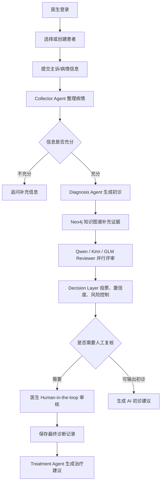

# MedConsensus 项目说明文档

MedConsensus 是一个面向医疗问诊辅助场景的多 Agent 共识诊断系统。系统接收患者主诉和补充信息，由信息收集 Agent、诊断 Agent、多个 Reviewer、决策层和医生复核环节共同生成辅助诊断意见，并在医生确认后生成最终诊断记录和治疗建议。

> 本系统定位为医生辅助工具，不应作为患者自诊或自动处方系统使用。最终诊断和用药建议必须由具备资质的医生确认。

## 1. 技术栈

后端：

- Java 17
- Spring Boot 3.3.0
- Spring Web / WebSocket / Validation / Actuator
- Spring Data JPA
- PostgreSQL + pgvector
- Redis
- Neo4j Java Driver
- Spring AI OpenAI Starter
- LangGraph4j 1.5.14
- OpenTelemetry + LangSmith 可观测追踪

前端：

- React 18
- Vite 5
- STOMP WebSocket
- lucide-react 图标

部署：

- Docker 多阶段构建
- Docker Compose
- 可选 nginx 反向代理

## 2. 目录结构

```text
MedConsensus
├── docker
│   ├── deploy
│   │   ├── Dockerfile
│   │   ├── docker-compose.yml
│   │   ├── .env
│   │   └── nginx/medconsensus.conf
│   └── postgres/init/01-init.sql
├── frontend
│   ├── src
│   │   ├── api
│   │   ├── components
│   │   ├── App.jsx
│   │   └── styles.css
│   └── vite.config.js
├── src/main/java/com/zyt/medconsensus
│   ├── agent
│   ├── config
│   ├── controller
│   ├── dto
│   ├── entity
│   ├── graph
│   ├── graphkg
│   ├── importer
│   ├── llm
│   ├── mapper
│   ├── observability
│   ├── rag
│   ├── service
│   └── tool
├── src/main/resources
│   ├── application.yml
│   └── static
└── pom.xml
```

## 3. 核心模块

| 模块 | 说明 |
| --- | --- |
| `agent` | Collector、Diagnosis、Reviewer、Treatment 等大模型 Agent |
| `graph` | LangGraph 工作流状态对象 |
| `service.impl.CollectorAgentServiceImpl` | 核心诊断流程编排，负责状态流转、Redis 会话、诊断快照、医生复核 |
| `llm.MultiModelGateway` | 多模型调用网关，按不同 Agent 配置模型、base URL、temperature |
| `tool.MedicalWorkflowTools` | 风险评估、信息充分性判断、投票、治疗关键词抽取等工具逻辑 |
| `graphkg` | Neo4j 医学知识图谱抽取、写入与推理查询 |
| `rag` / `importer` | pgvector 向量库配置、Embedding 调用、JSON 医疗数据导入 |
| `observability` | LangSmith / OpenTelemetry 追踪 |
| `controller` | 认证、工作台 API、SPA 路由转发 |
| `frontend/src` | 医生工作台前端页面和 API 封装 |

## 4. 业务流程



LangGraph 节点位于 `CollectorAgentServiceImpl`：

```text
collect -> assess -> ask_more_info / diagnose -> review -> decide -> human_review / finalize
```

## 5. 数据存储

PostgreSQL 主要表：

| 表 | 说明 |
| --- | --- |
| `doctor_basic_info` | 医生账号、手机号、科室、职称、密码哈希 |
| `patient_basic_info` | 医生名下患者基础信息 |
| `disease_medicine` | 疾病和药品建议基础库 |
| `final_diagnosis_record` | 医生复核后的最终诊断和治疗建议 |

pgvector 库：

| 库/表 | 说明 |
| --- | --- |
| `vector_db.medical_embedding` | 医疗语料切片、metadata、1024 维 embedding |

Redis 主要 key：

```text
medconsenus:collector:sessions:{userId}
medconsenus:collector:memory:{userId}:{sessionId}
medconsenus:collector:diagnosis:{userId}:{sessionId}
```

Neo4j：

- 存储医学实体和关系。
- 由 `MedicalKnowledgeGraphRepository` 查询症状、疾病、治疗路径。
- 当前推理服务在异常时会返回空结果，不阻断主诊断流程。

## 6. 后端接口

认证接口：

| 方法 | 路径 | 说明 |
| --- | --- | --- |
| `POST` | `/api/auth/register` | 医生注册，并写入 HTTP Session |
| `POST` | `/api/auth/login` | 医生登录 |
| `GET` | `/api/auth/me` | 获取当前登录医生 |
| `POST` | `/api/auth/logout` | 退出登录 |

工作台接口：

| 方法 | 路径 | 说明 |
| --- | --- | --- |
| `GET` | `/api/workspace/patients` | 查询当前医生患者列表 |
| `POST` | `/api/workspace/patients` | 新增患者 |
| `PUT` | `/api/workspace/patients/{patientId}` | 更新患者 |
| `DELETE` | `/api/workspace/patients/{patientId}` | 删除患者 |
| `GET` | `/api/workspace/sessions` | 查询会话列表 |
| `GET` | `/api/workspace/sessions/{sessionId}` | 查询会话详情 |
| `DELETE` | `/api/workspace/sessions/{sessionId}` | 删除会话 |
| `GET` | `/api/workspace/diagnosis` | 获取最近诊断结果 |
| `POST` | `/api/workspace/consultations` | 提交咨询内容，触发多 Agent 诊断流程 |
| `POST` | `/api/workspace/doctor-review` | 提交医生复核意见并生成最终记录 |
| `POST` | `/api/workspace/simulate` | 演示诊断流程推送 |

WebSocket：

| 项 | 值 |
| --- | --- |
| STOMP Endpoint | `/ws/diagnosis` |
| Topic | `/topic/pipeline` |
| 用途 | 推送 Collector、Diagnosis、Reviewer、Decision、Human Review 等流程进度 |

## 7. 前端说明

前端是 React + Vite 单页应用，主要模块：

| 文件 | 说明 |
| --- | --- |
| `frontend/src/App.jsx` | 应用主状态与布局入口 |
| `frontend/src/api/auth.js` | 登录、注册、当前用户、退出 |
| `frontend/src/api/workspace.js` | 患者、会话、诊断、医生复核 API |
| `frontend/src/api/websocket.js` | STOMP WebSocket 连接与进度订阅 |
| `frontend/src/components/AuthPanel.jsx` | 登录注册面板 |
| `frontend/src/components/Sidebar.jsx` | 患者和会话侧栏 |
| `frontend/src/components/DiagnosticPanel.jsx` | AI 诊断结果展示 |
| `frontend/src/components/DoctorPanel.jsx` | 医生复核意见输入 |
| `frontend/src/components/SessionDetailPanel.jsx` | 历史会话详情 |

开发环境通过 Vite 代理访问后端。生产环境前端静态资源由 Spring Boot 托管，因此只需要访问 `app` 服务或 nginx。

## 8. 模型配置

模型配置集中在 `application.yml` 的 `spring.ai.openai` 下：

| 配置段 | 当前职责 |
| --- | --- |
| `chat.options` | 主诊断模型 Diagnosis Agent |
| `collector` | 信息收集、病情整理 |
| `reviewers.qwen` | Qwen Reviewer |
| `reviewers.kimi` | Kimi Reviewer |
| `reviewers.glm` | GLM Reviewer |
| `decision` | 决策层路由判断 |
| `treatment` | 医生确认后生成治疗建议 |

生产环境通过 `API_KEY` 和 `MIMO_API_KEY` 注入密钥，不建议在 `application.yml` 中写真实 key。

## 9. 可观测性

项目支持 LangSmith 追踪，默认关闭。开启方式：

```text
LANGSMITH_ENABLED=true
LANGSMITH_API_KEY=your_langsmith_key
LANGSMITH_PROJECT=MedConsenus
LANGSMITH_CAPTURE_CONTENT=false
```

医疗场景建议保持：

```text
LANGSMITH_CAPTURE_CONTENT=false
```

这样只发送流程和元数据，避免把患者文本和提示词内容发送到外部追踪平台。

## 10. 开发约定

建议新增功能时遵循以下边界：

- Controller 只处理 HTTP 入参、Session 和响应包装。
- 业务编排放在 Service，尤其是诊断工作流相关逻辑。
- 大模型调用统一走 `MultiModelGateway`。
- 新增数据库表时优先补充 JPA Entity，同时为 Docker 初始化或迁移脚本补齐 SQL。
- 会话型临时数据放 Redis，最终诊断和医生确认结果落 PostgreSQL。
- 医疗建议相关文案要保留医生复核语义，避免表现为自动诊断或自动处方。

## 11. 已知注意点

- 项目配置名中多处使用 `MedConsenus` 拼写，这是当前代码和 Redis key 的既有命名，改名会影响配置、日志、key 和部署变量，需单独规划。
- `docker/deploy/.env` 是本地敏感配置文件，不要提交。
- `docker/postgres/init/01-init.sql` 只在 PostgreSQL volume 首次创建时执行。
- `final_diagnosis_record` 目前由 JPA `ddl-auto: update` 自动建表，生产环境长期建议改为显式迁移脚本。
- Neo4j 推理失败会降级为空证据，不会中断诊断流程。

